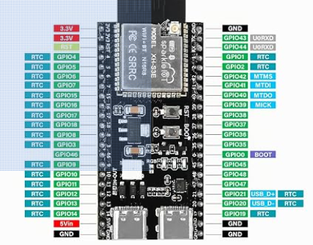
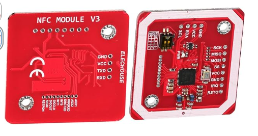
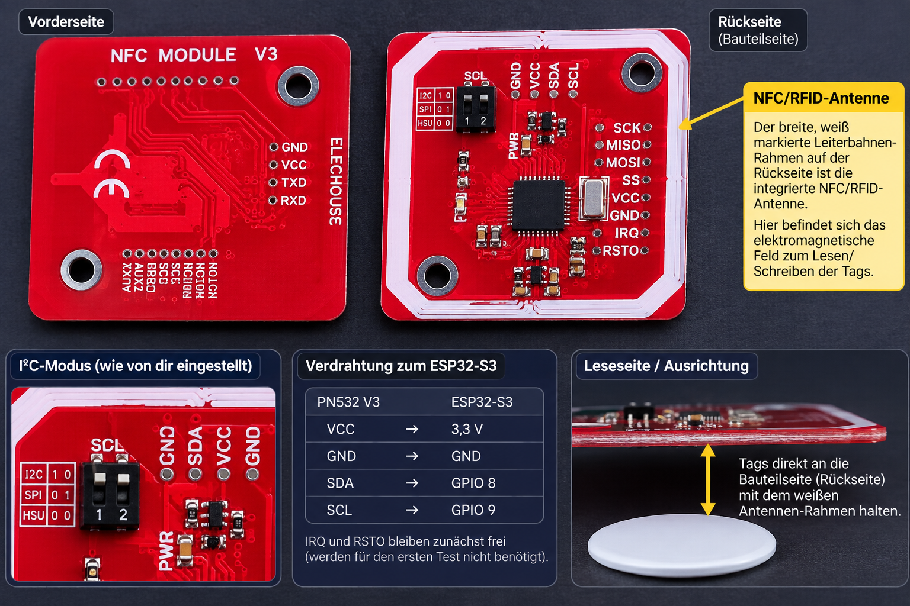
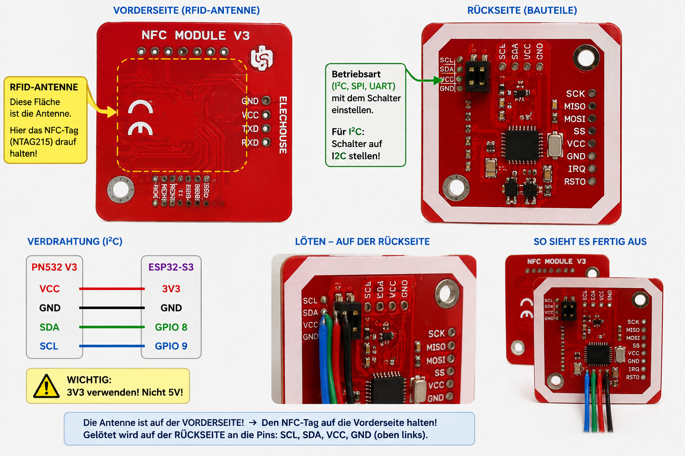
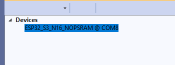
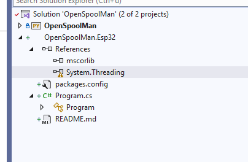

# AMSHelper – Hardware und Bilder

> Zur Gesamtübersicht: [START.md](../START.md)

Stand: 2026-08-21 15:12

## ESP32-S3

Das konkrete ESP32-S3-Board ist in `docs/img/amshelper/esp32-s3-pinout.png` dokumentiert.

Für den ersten I2C-Test:
- GPIO8 = SDA
- GPIO9 = SCL
- Versorgung PN532 = 3.3 V
- gemeinsame Masse erforderlich

## PN532 NFC Module V3

Originalansicht:

Beschriftete/erstellte Hilfsbilder:

Die große Leiterbahn-/Spulenfläche auf der Platine bildet die NFC-Antenne. Die Elektronik und Anschlussleisten liegen auf der Rückseite bzw. im Randbereich.

## Vier AMS-Slots

Es werden vier PN532 benötigt, einer je AMS-Slot.

WICHTIG:
Der verworfene, fehlerhafte Plan mit vier direkt parallel an GPIO8/GPIO9 angeschlossenen PN532 ist absichtlich NICHT in diesem Paket enthalten.

Vier PN532 mit gleicher I2C-Adresse `0x24` benötigen eine Bus-Trennung. Bevorzugt ist ein TCA9548A mit einem PN532 pro Kanal.

## Entwicklungsnachweis

Das eigene nanoFramework-Target wird in Visual Studio korrekt erkannt:

Das neu angelegte und funktionierende nanoFramework-Projekt:

## PN532-Verbindung praktisch bestätigt

Der Einzelreader funktioniert praktisch mit 3.3 V, GND, SDA=GPIO8 und SCL=GPIO9. Firmwareabfrage, NTAG215-Erkennung und Speicherzugriff sind bestätigt.
